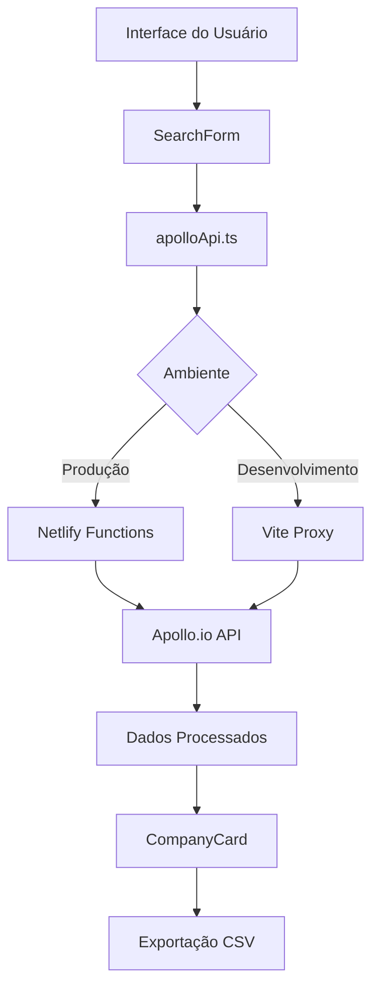

# 🚀 OnSet.IA Company Search

Uma aplicação React avançada para buscar empresas brasileiras e seus funcionários usando a API do Apollo.io, com foco em lead generation e prospecção comercial.


## 📋 Índice

- [Funcionalidades](#-funcionalidades)
- [Demo](#-demo)
- [Instalação](#-instalação)
- [Configuração](#-configuração)
- [Deploy](#-deploy)
- [Uso](#-uso)
- [Arquitetura](#-arquitetura)
- [API](#-api)
- [Contribuição](#-contribuição)
- [Licença](#-licença)

## ✨ Funcionalidades

### 🔍 Busca Inteligente de Empresas
- **Busca por Nome**: Encontre empresas específicas
- **Filtro por Localização**: Foque em regiões específicas do Brasil
- **Filtro por Setor**: Agronegócio, Tecnologia, Saúde, Finanças e mais
- **Filtro por Tamanho**: Empresas de 201 a 10.000+ funcionários
- **Filtro Automático de Site**: Mostra apenas empresas com URL de site válida

### 👥 Busca de Funcionários
- **Busca Rápida**: Encontre funcionários de uma empresa com um clique
- **Filtros Avançados**: Por cargo, senioridade e localização
- **Informações Detalhadas**: Nome, cargo, empresa, localização

### 📧 Captura de Emails
- **Busca de Emails**: Integração com Apollo.io para encontrar emails
- **Múltiplas Estratégias**: Sistema robusto com fallbacks
- **Validação**: Emails verificados e com status de confiança

### 📊 Exportação e Relatórios
- **Exportação CSV**: Dados completos das empresas
- **Exportação Paginada**: Exporte múltiplas páginas de resultados
- **Dados Estruturados**: Nome, site, setor, funcionários, localização

### 🎨 Interface Moderna
- **Design Responsivo**: Funciona em desktop, tablet e mobile
- **Notificações em Tempo Real**: Feedback visual das operações
- **Filtros Visuais**: Interface intuitiva para refinamento de busca
- **Cards Informativos**: Visualização clara dos dados das empresas

## 🌐 Demo

- **Produção**: [https://seu-site.netlify.app](https://seu-site.netlify.app)
- **Repositório**: [https://github.com/car2019sjc/teste-lead-company](https://github.com/car2019sjc/teste-lead-company)

## 🚀 Instalação

### Pré-requisitos
- Node.js 18+ 
- npm ou yarn
- Chave da API Apollo.io

### Instalação Local

```bash
# Clone o repositório
git clone https://github.com/car2019sjc/teste-lead-company.git

# Entre no diretório
cd teste-lead-company

# Instale as dependências
npm install

# Configure as variáveis de ambiente
cp .env.example .env
# Edite o arquivo .env com sua chave Apollo.io

# Execute em modo desenvolvimento
npm run dev
```

## ⚙️ Configuração

### Variáveis de Ambiente

Crie um arquivo `.env` na raiz do projeto:

```env
# Apollo.io API Configuration
VITE_APOLLO_API_KEY=sua_chave_apollo_aqui

# Environment
NODE_ENV=development
```

### Obtenção da Chave Apollo.io

1. Acesse [Apollo.io](https://app.apollo.io)
2. Faça login em sua conta
3. Vá para Settings > Integrations > API
4. Copie sua API Key

## 🚀 Deploy

### Netlify (Recomendado)

#### Deploy Automático
1. Conecte seu repositório GitHub ao Netlify
2. Configure as variáveis de ambiente:
   ```
   VITE_APOLLO_API_KEY=sua_chave_apollo_aqui
   NODE_ENV=production
   ```
3. O deploy será automático a cada push na branch `main`

#### Configuração Manual
```bash
# Build para produção
npm run build

# Deploy no Netlify CLI
netlify deploy --prod --dir=dist
```

### GitHub Pages

#### Configuração Automática
1. Configure os secrets no repositório:
   - `VITE_APOLLO_API_KEY`: Sua chave Apollo.io
2. Ative GitHub Pages:
   - Settings > Pages
   - Source: Deploy from a branch
   - Branch: `gh-pages`

### Deploy Local

```bash
# Build para produção
npm run build

# Preview local
npm run preview
```

## 📖 Uso

### Busca Básica de Empresas

1. **Acesse a aplicação**
2. **Preencha os filtros**:
   - Nome da empresa (opcional)
   - Localização (recomendado): ex: "São Paulo", "Rio de Janeiro"
   - Área de negócio (recomendado): ex: "Tecnologia", "Agronegócio"
   - Tamanho da empresa: selecione a faixa de funcionários
3. **Clique em "Buscar Empresas"**

### Busca de Funcionários

1. **Encontre uma empresa** nos resultados
2. **Clique em "Busca Rápida"** no card da empresa
3. **Visualize os funcionários** encontrados
4. **Busque emails** clicando no botão de email de cada pessoa

### Exportação de Dados

1. **Realize uma busca** de empresas
2. **Clique em "Exportar Empresas (CSV)"**
3. **Selecione o intervalo de páginas** para exportar
4. **Aguarde o download** do arquivo CSV

## 🏗️ Arquitetura

### Estrutura do Projeto

```
src/
├── components/              # Componentes React
│   ├── CompanyCard.tsx     # Card de empresa
│   ├── SearchForm.tsx      # Formulário de busca
│   ├── IndustryFilter.tsx  # Filtros por setor
│   ├── PeopleSearchModal.tsx # Modal de busca de pessoas
│   └── ...
├── services/               # Serviços de API
│   ├── apolloApi.ts       # Cliente Apollo.io
│   └── emailCapture.ts    # Captura de emails
├── types/                 # Tipos TypeScript
│   └── apollo.ts         # Tipos da API Apollo
├── config/               # Configurações
│   └── api.ts           # Configuração da API
├── hooks/               # Hooks customizados
│   └── useLocalStorage.ts
└── App.tsx             # Componente principal

netlify/
├── functions/          # Netlify Functions
│   ├── apollo-proxy.js # Proxy para API Apollo
│   └── test-api.js    # Função de teste

public/
├── _headers           # Headers HTTP
└── _redirects        # Redirects do Netlify
```

### Tecnologias Utilizadas

- **Frontend**: React 18, TypeScript, Tailwind CSS
- **Build**: Vite
- **Deploy**: Netlify Functions, GitHub Actions
- **API**: Apollo.io REST API
- **Ícones**: Lucide React
- **HTTP Client**: Fetch API nativo

### Fluxo de Dados



## 🔌 API

### Endpoints Utilizados

#### Busca de Empresas
```typescript
POST /v1/mixed_companies/search
POST /v1/organizations/search
```

#### Busca de Pessoas
```typescript
POST /v1/mixed_people/search
POST /v1/contacts/search
POST /v1/people/search
```

#### Busca de Emails
```typescript
POST /v1/people/match
GET /v1/people/{id}
```

### Estrutura de Dados

#### Empresa
```typescript
interface Company {
  id: string;
  name: string;
  website_url?: string;
  industry?: string;
  num_employees?: number;
  headquarters_address?: string;
  linkedin_url?: string;
  // ... outros campos
}
```

#### Pessoa
```typescript
interface Person {
  id: string;
  name: string;
  title: string;
  email?: string;
  organization?: {
    name: string;
    website_url?: string;
  };
  // ... outros campos
}
```

## 🔧 Funcionalidades Técnicas

### Sistema de Proxy Inteligente
- **Desenvolvimento**: Proxy Vite para CORS
- **Produção**: Netlify Functions com fallback para API direta
- **Tratamento de Erros**: Múltiplas estratégias de recuperação

### Filtros Avançados
- **Filtro de Site**: Remove empresas sem website
- **Normalização**: Tratamento de acentos e caracteres especiais
- **Cache Local**: Otimização de performance

### Exportação Robusta
- **Paginação**: Exporta múltiplas páginas automaticamente
- **Encoding UTF-8**: Suporte completo a caracteres especiais
- **Timeout Protection**: Evita travamentos em grandes volumes

## 🤝 Contribuição

### Como Contribuir

1. **Fork** o projeto
2. **Crie uma branch** para sua feature (`git checkout -b feature/AmazingFeature`)
3. **Commit** suas mudanças (`git commit -m 'Add some AmazingFeature'`)
4. **Push** para a branch (`git push origin feature/AmazingFeature`)
5. **Abra um Pull Request**

### Padrões de Código

- **TypeScript**: Tipagem estrita
- **ESLint**: Linting automático
- **Prettier**: Formatação consistente
- **Commits**: Mensagens descritivas em português

### Estrutura de Commits

```
feat: adicionar nova funcionalidade
fix: corrigir bug específico
docs: atualizar documentação
style: mudanças de formatação
refactor: refatoração de código
test: adicionar ou modificar testes
```

## 📝 Changelog

### v1.0.0 (2025-01-25)
- ✅ Implementação inicial da busca de empresas
- ✅ Filtro automático por URL de site
- ✅ Sistema de busca de funcionários
- ✅ Exportação CSV com múltiplas páginas
- ✅ Deploy automático Netlify + GitHub Actions
- ✅ Sistema robusto de proxy com fallbacks
- ✅ Interface responsiva completa

## 🐛 Problemas Conhecidos

- **Rate Limiting**: Apollo.io tem limites de requisições por minuto
- **CORS**: Algumas configurações podem requerer proxy
- **Cache**: Resultados podem ser cached pelo Apollo.io

## 📞 Suporte

- **Issues**: [GitHub Issues](https://github.com/car2019sjc/teste-lead-company/issues)
- **Documentação**: Este README
- **API Apollo.io**: [Documentação Oficial](https://apolloio.github.io/apollo-api-docs/)

## 📄 Licença

Este projeto está licenciado sob a Licença MIT - veja o arquivo [LICENSE](LICENSE) para detalhes.

---

**Desenvolvido com ❤️ para otimizar sua prospecção comercial**

[](https://app.netlify.com/sites/your-site/deploys)